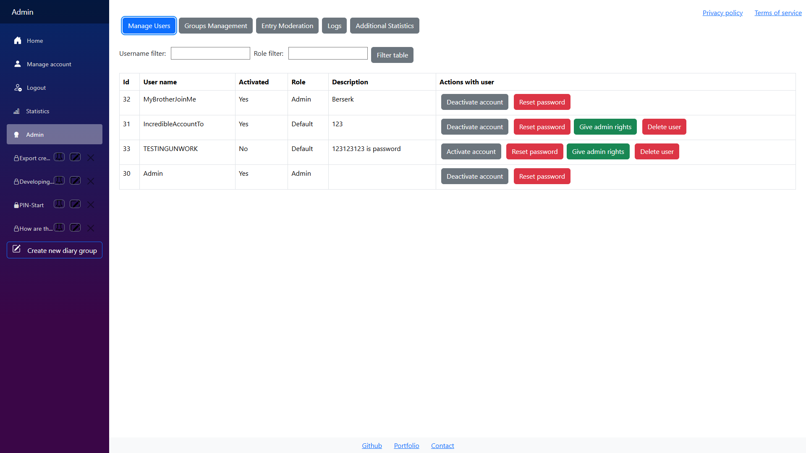
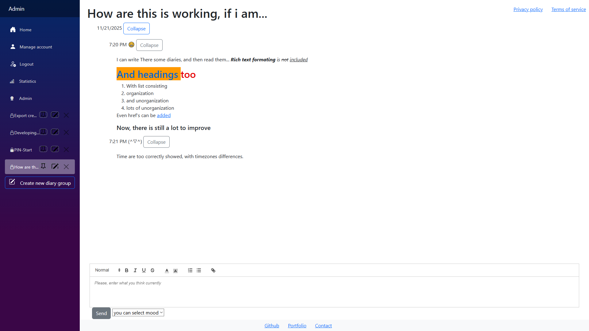
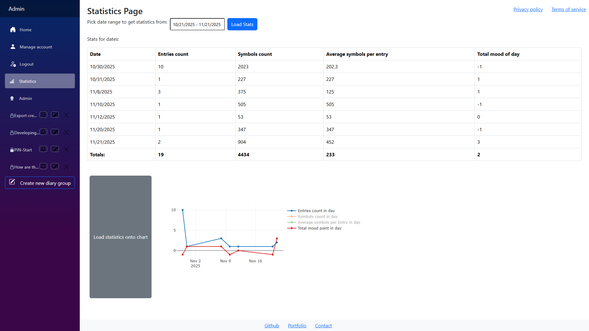

# WebDiary

Private diary web app built with ASP.NET Core and Blazor Server. Create diary groups, write rich entries, and review statistics from any device.

## Status
Active development. Updated March 12, 2026.

## Live demo
https://webdiary-frontend.onrender.com

## Screenshots




## Features
- Authentication and registration
- Diary groups with optional PIN protection
- Rich text editor for entries
- Automatic timestamps and validation
- Mood tracking (emoji scale)
- Statistics dashboard
- Admin panel
- PDF export (per group or all groups)
- Light and dark themes
- Serilog-based logging
- Unit tests

## Tech stack
- ASP.NET Core Web API
- Blazor Server
- Entity Framework Core
- PostgreSQL
- Serilog
- Bootstrap
- xUnit and Moq
- Docker (optional)

## Quick start (local)
1. Prerequisites: .NET 9 SDK, PostgreSQL, Visual Studio or VS Code.
2. Configure secrets or environment variables:
   - `Jwt:Key` - Secret key for JWT signing.
   - `ConnectionStrings:DiariesConnection` - PostgreSQL connection string.
3. Run the apps:
   ```bash
   dotnet run --project WebDiary
   dotnet run --project WebDiary.Frontend
   ```
4. Database migrations run automatically on startup.

## Architecture overview
Backend:
- Controllers handle HTTP requests
- Services contain business logic
- EF Core data layer and entities
- DTOs define API contracts

Frontend:
- Razor components for UI
- API client classes for HTTP calls
- Frontend models matching DTOs

Request flow: UI component -> API client -> controller -> service -> database -> DTO response.

## Email integration
Mailgun is used for email notifications. Due to sandbox limitations, email sending is enabled only for development and testing environments.

## Use cases
- Personal diary and mood tracking
- Productivity journals
- Internal team logs
- Admin dashboards

## Roadmap
See `ROADMAP.md`.

## Contributing
Pull requests are welcome. For major changes, open an issue first to discuss the proposal.
