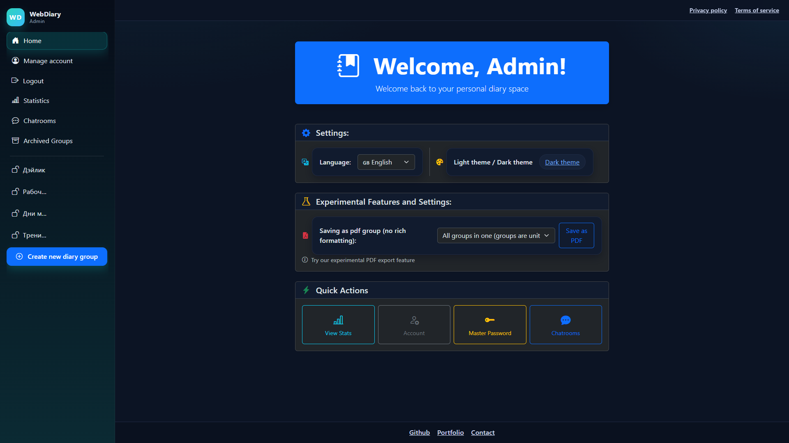

# WebDiary - Full-Stack Diary Management Application



A modern, feature-rich diary application built with **ASP.NET Core** and **Blazor Server**, designed for personal journaling, thematic diary organization, mood tracking, and secure data management.

## Overview

WebDiary is a comprehensive digital diary platform for personal journaling and mood tracking. Organize your diary entries by theme (sports, ideas, daily thoughts, etc.), track your mood patterns, access advanced analytics, and maintain a secure personal journal with powerful features.

### Implemented Features

**Authentication & Security**
- Secure JWT-based authentication with refresh tokens
- Password hashing using identity framework hashing
- Master password support for enhanced security
- PIN codes for secure group access

**Diary Management**
- Create and manage unlimited personal diary entries
- Rich text editing with HTML content support
- Organize entries by thematic groups (sports, ideas, etc.)
- Entries with timestamps and comprehensive metadata
- Full CRUD operations with permission-based access control

**Mood & Analytics**
- Mood tracking with visual mood entries
- Advanced statistics dashboard
- Mood trends visualization with interactive charts
- Personal activity metrics and frequency analysis
- Mood distribution analysis with custom date range filtering

**Data Export**
- Export diary entries as formatted PDF
- HTML sanitization for safe content display
- Export statistics and analytics reports

**Localization**
- Full support for English and German languages
- Localized error messages and resources
- Multi-language UI components

**Frontend Experience**
- Interactive Blazor Server-based application
- Responsive Bootstrap-based design
- Real-time updates with SignalR
- Local and session storage for client-side state
- Date range picker for flexible filtering
- Rich text editor for diary entries

**Admin Features**
- Admin panel for user and diary group management
- System statistics and usage analytics
- User activity monitoring

**Enhanced Collaboration**
- Users able to share group spaces with other users
- Role-Based permission levels (owner, editor, viewer)
- Referencing others entries entirely or partly in your own

## Technology Stack

### Backend
- **Framework**: ASP.NET Core 9.0
- **Language**: C#
- **Database**: PostgreSQL 16
- **ORM**: Entity Framework Core 9.0
- **Authentication**: JWT Bearer tokens
- **API Communication**: RESTful APIs + SignalR WebSockets
- **Logging**: Serilog with PostgreSQL sink
- **PDF Export**: PDFsharp
- **HTML Processing**: HtmlAgilityPack

### Frontend
- **Framework**: Blazor Server (Interactive Server Components)
- **.NET Target**: net9.0
- **UI Framework**: Bootstrap Blazor 9.4.2
- **Charts**: Plotly.Blazor for interactive data visualization
- **Rich Text Editor**: Quilljs
- **Date Picker**: BlazorDateRangePicker
- **HTTP Client**: RestSharp
- **Authentication**: JWT with custom AuthenticationStateProvider
- **Logging**: Serilog

### Database
- **PostgreSQL 16** for data persistence
- **EF Core Migrations** for schema management
- **Connection Pooling** for performance optimization

### DevOps & Deployment
- **Containerization**: Docker with multi-stage builds
- **Orchestration**: Docker Compose
- **Development Environment**: VS Code / Visual Studio 2022
- **CI/CD Ready**: Current deployment on Render

## Installation & Setup

### Prerequisites

- **.NET SDK 9.0** or later
- **PostgreSQL 16** or later
- **Docker & Docker Compose** (for containerized deployment)
- **Visual Studio 2022** or **VS Code** with C# extension

### Local Development

1. **Clone the repository**
   ```bash
   git clone https://github.com/yourusername/WebDiary.git
   cd WebDiary
   ```

2. **Configure environment variables**
   ```bash
   cp .env.example .env
   # Edit .env with your configuration:
   # - DIARIES_CONNECTION_STRING
   # - JWT_TOKEN_KEY (use a strong secret)
   ```

3. **Set up PostgreSQL database**
   ```bash
   # Ensure PostgreSQL is running and accessible
   # Update connection string in .env if needed
   ```

4. **Apply database migrations**
   ```bash
   cd WebDiary
   dotnet ef database update
   cd ..
   ```

5. **Run the backend**
   ```bash
   cd WebDiary
   dotnet run
   # Backend runs at http://localhost:5281
   ```

6. **Run the frontend** (in another terminal)
   ```bash
   cd WebDiary.Frontend
   dotnet run
   # Frontend runs at http://localhost:5282
   ```

### Docker Deployment

See [README.Docker.md](./README.Docker.md) for complete Docker setup instructions.

Quick start with Docker Compose:
```bash
# Build and run all services
docker-compose up -d

# Frontend: http://localhost:5282
# Backend API: http://localhost:5281
# Database: localhost:5432
```

## Configuration

### Environment Variables

See `.env.example` for all available configuration options:

| Variable | Description | Default |
|----------|-------------|---------|
| `DIARIES_CONNECTION_STRING` | PostgreSQL connection string | |
| `JWT_TOKEN_KEY` | Secret key for JWT signing | |
| `ASPNETCORE_ENVIRONMENT` | Runtime environment | Development |
| `API_CONNECTION` | Backend API URL | http://localhost:5281 |

### Application Settings

Modify `appsettings.json` for additional configuration:
- Logging levels
- JWT issuer and audience
- Frontend URL
- Database options

## Development

### Running Tests

```bash
dotnet test WebDiary.Tests/WebDiary.Tests.csproj
```

### Building for Release

#### Backend
```bash
cd WebDiary
dotnet publish -c Release -o ./publish
```

#### Frontend
```bash
cd WebDiary.Frontend
dotnet publish -c Release -o ./publish
```

### Code Organization & Best Practices

- **Separation of Concerns**: Controllers delegate to services, services contain business logic
- **DTOs**: Used for API communication to decouple domain models
- **Dependency Injection**: Extensive use via ASP.NET Core's DI container
- **Entity Framework**: Migrations for schema management
- **Logging**: Structured logging with Serilog throughout application
- **Localization**: Resource files for multi-language support
- **Security**: Password hashing, JWT validation, authorization policies

## Security Features

**Implemented**
- JWT-based authentication with expiration and refresh tokens
- Password hashing using ASP.NET Core Identity hashing
- Master password support for sensitive data access
- HTTPS enforcement in production
- CORS configuration
- Secure cookie handling
- User secrets management

**Planned**
- Multi-factor authentication (MFA)
- Two-factor authentication (2FA)
- Rate limiting
- Request signing

## Development Status

For detailed feature roadmap, progress updates, and known issues, see [ROADMAP.md](./ROADMAP.md).

## Deployment

### Production Deployment

The application is currently deployed on **Render** cloud platform:
- **Backend**: https://webdiary-api.onrender.com
- **Frontend**: https://webdiary-frontend.onrender.com

### Deployment Guide

1. **Using Docker** (Recommended)
   - See [README.Docker.md](./README.Docker.md)

2. **Manual Deployment**
   - Publish projects: `dotnet publish -c Release`
   - Upload binaries to hosting platform
   - Configure environment variables
   - Run application

3. **CI/CD Pipeline**
   - GitHub Actions configuration available
   - Automatic builds on push
   - Docker image builds and pushes

## Contributing

Contributions are welcome! Please follow these guidelines:

1. Create a feature branch (`git checkout -b feature/amazing-feature`)
2. Commit changes (`git commit -m 'Add amazing feature'`)
3. Push to branch (`git push origin feature/amazing-feature`)
4. Open a Pull Request

## License

This project is licensed under the MIT License - see the LICENSE file for details.

## Portfolio Highlights

This project demonstrates:

- Full-stack development with modern .NET technologies
- Interactive UI using Blazor Server with responsive design
- Production-grade security with JWT and password management
- Complex business logic including statistics, PDF generation, and integrations
- Database design with proper relationships and migrations
- DevOps practices with Docker containerization
- Internationalization supporting multiple languages
- Real-time features using SignalR
- Testing practices with unit test coverage
- Code quality with proper architecture and patterns

## Contact & Support

- **Issues**: GitHub Issues
- **Email**: matveyeresko1@gmail.com
- **Portfolio**: [Portfolio Link](https://oilpilot.github.io/Portfolio/)

---

**Version**: 1.0.0  
**Last Updated**: March 2026  
**Status**: Active Development
